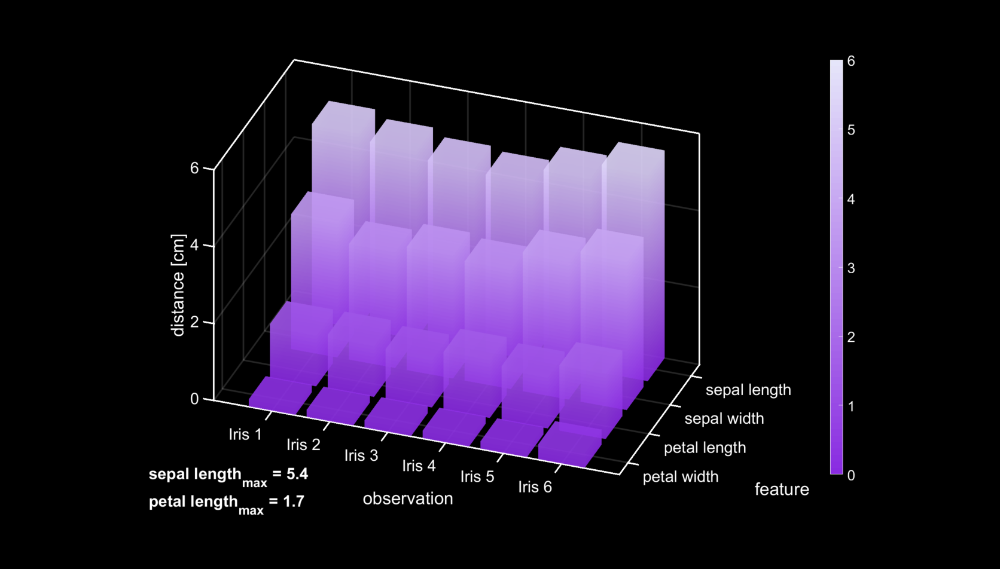

# darkBar3
Plot 3-D bar graph with dark (or custom) plot background, selected color scheme and annotations.

usage:

```matlab
call_dark3Dbar()
```

Cite As

C. B. Nzakimuena, "Automated analysis of retinal and choroidal OCT and OCTA images in AMD," Polytechnique Montréal, 2020


