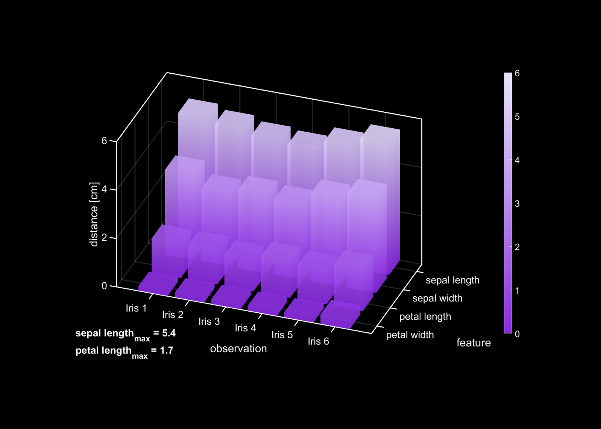

# darkBar3
Plot 3-D bar graph with dark (or custom) plot background, selected color scheme and annotations.

usage:

```matlab
call_dark3Dbar()
```

Cite As

Bélanger Nzakimuena, C. (2020). Automated Analysis of Retinal and Choroidal OCT and OCTA Images in AMD (Masters thesis, Polytechnique Montréal). Retrieved from https://publications.polymtl.ca/5234/


